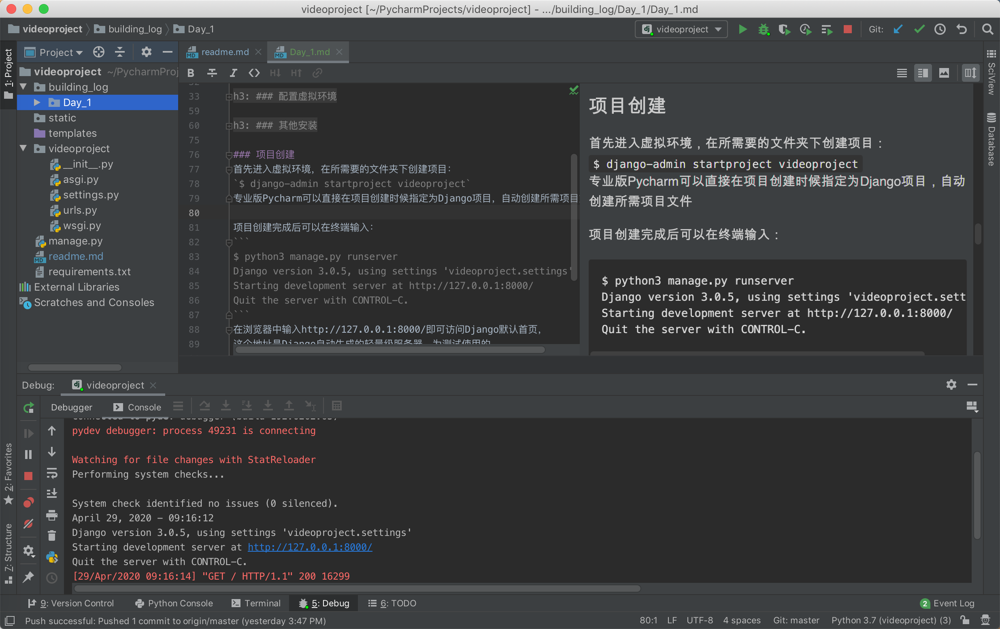
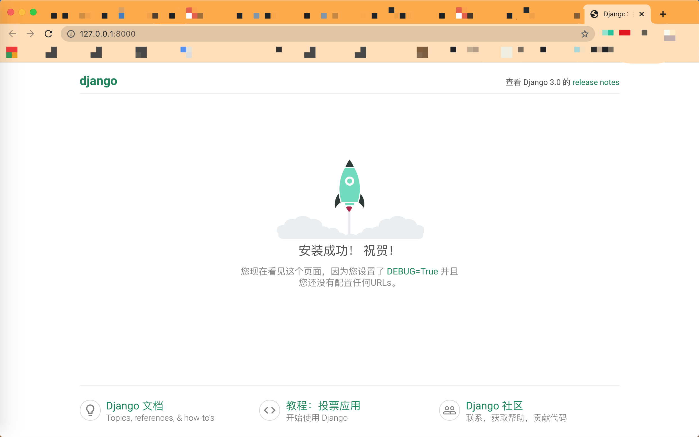

## 第一天 配置环境与项目创建

### 安装Python（编译器）  
`$ brew install python`  

brew 会自动安装pip和一些基础Python包    
安装完毕后，在终端输入 `python3 -v` ，
如果输出了 Python 的版本号，说明 Python 已安装成功。   
```
$python3 -V
Python 3.7.4
```

### 安装MySQL（数据库）  
MAC系统可以去 [MySQL官网](https://dev.mysql.com/downloads/mysql/)
直接下载安装包，安装过程会提示设置账号密码，一定要牢记。  
安装完成之后输入 `$ mysql -V` 查看MySQL版本。  
```
$ mysql -V
mysql  Ver 8.0.17 for osx10.14 on x86_64 (Homebrew)
``` 
并创建所需数据库，不要忘记分号：
```
mysql> create DATABASE video;
```

### 安装PyCharm（IDE）  
Pycharm是jetbrain公司极其强大的PythonIDE，跨平台，性能好，
以下所有的开发全部在Pycharm中完成。  
到 [Pycharm官网](https://www.jetbrains.com/pycharm/download/#section=mac)
下载安装包安装即可，本人使用的是专业版。

### 配置虚拟环境
虚拟环境在开发中是非常重要的，为了避免不同项目所用的库的不同、
版本不一而造成环境混乱，通常为每一个项目单独配置环境。  
```
$ pip3 install virtualenv
$ pip3 install virtualenvwrapper
```

然后创建一个文件夹，通常命名为workspace或.workspace  
`$ mkdir workspace`  
pip安装完成之后在.bashrc文件中添加如下：
```
$ vim .bashrc

export WORKON_HOME=/home/thomason/workspace
export VIRTUALENVWRAPPER_PYTHON=/usr/bin/python3
export VIRTUALENVWRAPPER_VIRTUALENV=/usr/local/bin/virtualenv
source /usr/local/bin/virtualenvwrapper.sh
```
所有路径全部填写绝对路径 
 
创建虚拟环境：`$ mkvirtualenv videoproject`  
进入虚拟环境：`$ workon videoproject`  
退出虚拟环境：`$ deactivate`  
列出虚拟环境：`$ lsvirtualenv`  
删除虚拟环境：`$ rmvirtualenv videoproject`

### 其他安装
这个就是对于项目开发可能用到的Python库，
我保存在了 [requirements.txt](/requirements.txt) 里面
```asgiref==3.2.7
Django==3.0.5
django-chunked-upload==2.0.0
django-ratelimit==2.0.0
Pillow==7.1.2
PyMySQL==0.9.3
pytz==2019.3
sorl-thumbnail==12.6.3
sqlparse==0.3.1
```
可以直接使用pip进行安装：  
`$ pip3 install -r requirements.txt`

### 项目创建
首先进入虚拟环境，在所需要的文件夹下创建项目：  
`$ django-admin startproject videoproject`  
专业版Pycharm可以直接在项目创建时候指定为Django项目，自动创建所需项目文件


项目创建完成后可以在终端输入：
```
$ python3 manage.py runserver
Django version 3.0.5, using settings 'videoproject.settings'
Starting development server at http://127.0.0.1:8000/
Quit the server with CONTROL-C.
```
在浏览器中输入http://127.0.0.1:8000/即可访问Django默认首页，
这个地址是Django自动生成的轻量级服务器，为测试使用的。


### 项目配置
项目的配置文件在 `videoproject/videoproject/settings.py`  

首先需要配置的是文字编码格式，django默认的编码是英文格式，
我们把它改成中文格式，需要修改下面几个变量的值。
```
LANGUAGE_CODE = 'zh-hans' # zh-hans为中文编码
TIME_ZONE = 'Asia/Shanghai' # 国际时区改成中国时区
USE_I18N = True
USE_L10N = True
USE_TZ = False
```

然后还需要配置静态资源文件目录，用于存储CSS、Javascript、Images等文件。
这里我们设置目录为/static/
```
STATIC_URL = '/static/'
STATICFILES_DIRS = (
    os.path.join(BASE_DIR, "static"),
)
```

最后配置我们的MySQL数据库。django默认使用的是sqlite数据库，
我们修改为mysql数据库。找到DATABASES节点，修改为如下代码。
其中，NAME为数据库名，USER为MySQL的用户名，PASSWORD为密码，
HOST为127.0.0.1 本地数据库，如果外链数据库的话改为外链数据库ip，PORT为3306
```
DATABASES = {
    'default': {
        'ENGINE': 'django.db.backends.mysql',
        'NAME': 'video',
        'USER': 'root',
        'PASSWORD': 'password',
        'HOST': '127.0.0.1',
        'PORT': '3306',
    }
}
```

配置好数据库后，还需要在 `videoproject/videoproject/__init__.py` 中安装驱动:
```
import pymysql
pymysql.install_as_MySQLdb()
```

上面代码运行的前提是你电脑上已经安装了PyMySQL类库。

最后可再次运行工程，检查配置是否正确。