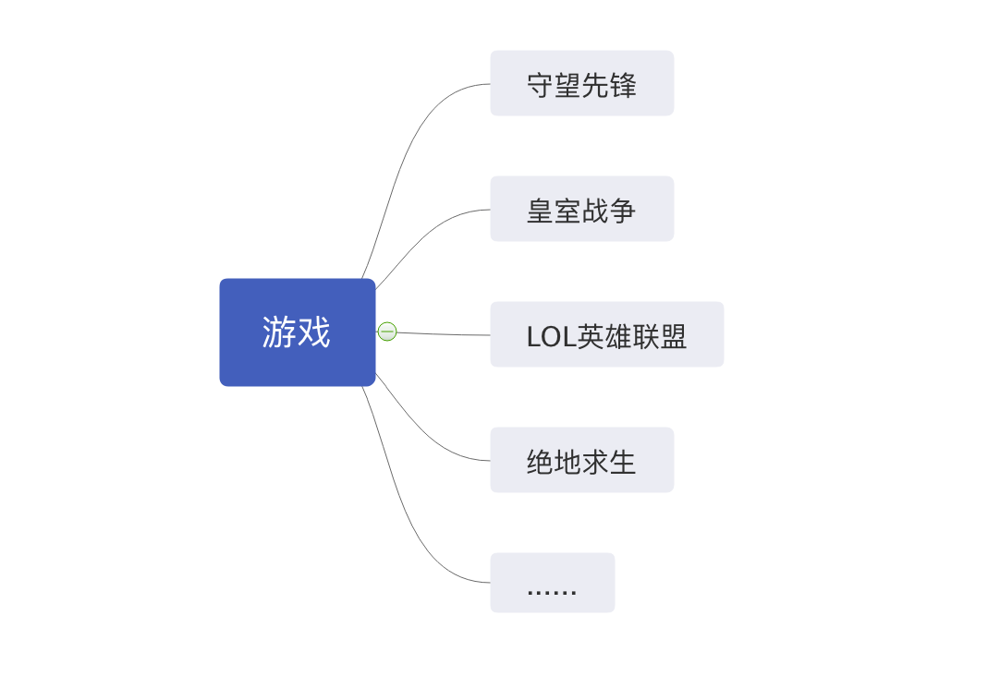

## 第三天首页功能

### 创建video应用
同样的，我们依然需要一个video应用为我们首页的视频服务，
直接在终端输入：
```
python manage.py startapp video
```
这时候我们就可以看到在项目文件夹中多出了一个video文件夹，
创建完应用之后我们依然需要到settings.py里面注册应用：
```
INSTALLED_APPS = [
    'django.contrib.admin',
    'django.contrib.auth',
    'django.contrib.contenttypes',
    'django.contrib.sessions',
    'django.contrib.messages',
    'django.contrib.staticfiles',
    'users',
    'video',
]
```
注册完成后对应用分发路由，注意是在与项目同名的文件夹下的urls.py哦。
```
urlpatterns = [
    path('admin/', admin.site.urls),
    path('users/', include('users.urls')),
    path('video/', include('video.urls')),
]
```

### 需求分析
作为一个视频播放网站的首页，首先肯定是要有视频的，但是光有视频还不够。
为了能让使用者能够更好地找到他们心仪的视频，我们是不是还需要有一个分类功能，为每一个视频统一类别，这样就非常好找了。
比如 [B站首页](https://www.bilibili.com/)
上面有不同的分区，比如游戏区，舞蹈区等等。  

所以我们需要在models.py里面创建video视频表和classification分类表。
并且这两个表之间需要有关联，分类对视频是一对多的，一个分类下面可以有好多个视频。
而视频只能对应向上单一的分类。这里就需要用到ForeignKey外键连接的方式连接两个表。
更多说明详见官方文档 [ForeignKey](https://docs.djangoproject.com/en/3.0/ref/models/fields/#django.db.models.ForeignKey)

### 建表
需求分析之后就可以按照需求建表了：
```
class Classification(models.Model):
    list_display = ("title",)
    title = models.CharField(max_length=100, blank=True, null=True)
    status = models.BooleanField(default=True)

    class Meta:
        db_table = 'v_classification'


class Video(models.Model):
    STATUS_CHOICES = (
        ('0', '发布中'),
        ('1', '未发布'),
    )
    title = models.CharField(max_length=100, blank=True, null=True)
    desc = models.CharField(max_length=255, blank=True, null=True)
    classification = models.ForeignKey(Classification, on_delete=models.CASCADE, null=True)
    file = models.FileField(max_length=255)
    cover = models.ImageField(upload_to='cover/', blank=True, null=True)
    status = models.CharField(max_length=1, choices=STATUS_CHOICES, blank=True, null=True)
    create_time = models.DateTimeField(auto_now_add=True, blank=True, max_length=20)
```
字段说明：  
Classification 类: 
+ list_display 展示字段，目前只放一个分类标题在里面，后面留了逗号可以随时添加
+ title 分类名称，数据类型是CharField，最大长度为max_length=100，允许为空null=True
+ status 是否启用。数据类型是BooleanField,默认为default=True
+ db_table 表名  

Video 类：
+ title 视频标题。数据类型是charField，最大长度为max_length=100，允许为空null=True
+ desc 视频描述。数据类型是charField，最大长度为max_length=255，允许为空null=True
+ file 视频文件地址。数据类型是fileField。其中存的是视频文件的地址，在之后的视频管理中我们将会对视频的上传进行具体的讲解。
+ cover 视频封面。数据类型是ImageField。存储目录为upload_to='cover/'，允许为空null=True
+ status 视频状态。是一个选择状态，用choices设置多选元祖。
+ create_time 创建时间。数据类型是DateTimeField 。设置自动生成时间auto_now_add=True

### urls分发路由
同样的，对于video应用，我们依然需要配置路由进行访问：
```
from django.urls import path
from . import views

app_name = 'video'
urlpatterns = [
    path('index/', views.IndexView.as_view(), name='index'),
    path('search/', views.SearchListView.as_view(), name='search'),
]
```
index/为主页显示  
search/为后面需要使用的搜索功能

### 列表显示(视图类)
首页不仅需要数据库的配置，前端也需要能够显示出来并对它进行渲染。
我们使用django中内置的视图模版类ListView来显示，
首先在view.py中编写IndexView类，用它来显示列表数据。键入如下代码：
```
class IndexView(generic.ListView):
    model = Video
    template_name = 'video/index.html'
    context_object_name = 'video_list'  
```
此处，我们使用了django提供的通用视图类ListView。
ListView使用很简单，只需要我们简单的配置几行代码，即可将数据库里面的数据渲染到前端。
比如上述代码中，我们配置了
+ model = Video, 作用于Video模型
+ template_name = 'video/index.html' ，告诉ListView要使用我们已经创建的模版文件。
+ context_object_name = 'video_list'  ，上下文变量名，告诉ListView，在前端模版文件中，可以使用该变量名来展现数据。

之后，我们在templates文件夹下，建立video目录，用来存放视频相关的模板文件。
首先我们创建首页文件index.html。并将刚才获取到的数据显示出来。
（这边依然展示的是html中核心内容，粘贴[原项目](https://github.com/geeeeeeeek/videoproject) 
的前端代码，前端相关开发还需等待Ryan Ma同步进度）
```
<div class="ui grid">
    
    <div class="four wide column">
        <div class="ui card">
            <a class="image">
                
                
                
                
                <i class="large play icon v-play-icon"></i>
            </a>
            <div class="content">
                <a class="header">{{ item.title }}</a>
                <div class="meta">
                    <span class="date">发布于{{ item.create_time|time_since}}</span>
                </div>
                <div class="description">
                    {{ item.view_count}}次观看
                </div>
            </div>
        </div>
    </div>
    
    <h3>暂无数据</h3>
    
</div>
```
通过for循环，将video_list渲染到前端。这里我们使用到了django中的
[内置标签](https://docs.djangoproject.com/en/3.0/ref/templates/builtins/)，
比如for语句、empty语句。这些都是django中非常常用的语句。在之后的教程中我们会经常遇到。
另外，还使用了 [thumbnail](https://sorl-thumbnail.readthedocs.io/en/latest/installation.html)
标签来显示图片，thumbnail是一个很常用的python库，常常被用来做图片显示。

### 分类功能
在写分类功能之前，我们先学习一个回调函数 get_context_data()
这是ListView视图类中的一个函数，在 get_context_data() 函数中，
可以传一些额外内容到模板。因此我们可以使用该函数来传递分类数据。  
要使用它，很简单。只需要在IndexView类下面，追加get_context_data()的实现即可。
```
class IndexView(generic.ListView):
    model = Video
    template_name = 'video/index.html'
    context_object_name = 'video_list' 

    def get_context_data(self, *, object_list=None, **kwargs):
        context = super(IndexView, self).get_context_data(**kwargs)
        classification_list = Classification.objects.filter(status=True).values()
        context['classification_list'] = classification_list
        return context

```
在上述代码中，我们将分类数据通过Classification.objects.filter(status=True).values()从数据库里面过滤出来，
然后赋给classification_list，最后放到context字典里面。  
在前端模板（templates/video/index.html）中，
就可以通过classification_list来取数据。添加代码:
```
<div class="classification">
    <a class="ui red label" href="">全部</a>
    
    <a class="ui label" href="">{{ item.title }}</a>
    
</div>
```
当然现在只是实现了分类展示效果，我们还需要继续实现点击效果，
即点击不同的分类，显示不同的视频列表。

我们先给每个分类按钮加上href链接：
```
<div class="classification">
    <a class="ui red label" href="">全部</a>
    
    <a class="ui label" href="?c={{ item.id }}">{{ item.title }}</a>
    
</div>
```
通过添加?c={{ item.id }} 这里用c代表分类的id，点击后，会传到视图类中，
在视图类中，我们使用 get_queryset() 函数，将get数据取出来。
通过self.request.GET.get("c", None) 赋给c，判断c是否为None，如果为None，就响应全部，
如果有值，就通过get_object_or_404(Classification, pk=self.c)先获取当前类，然后classification.video_set获取外键数据。
```
    def get_queryset(self):
        self.c = self.request.GET.get("c", None)
        if self.c:
            classification = get_object_or_404(Classification, pk=self.c)
            return classification.video_set.all().order_by('-create_time')
        else:
            return Video.objects.filter(status=0).order_by('-create_time')
```

### 分页功能
在Django中，有现成的分页解决方案，我们开发者省了不少事情。
如果是简单的分页，只需要配置一下paginate_by即可实现。
```
class IndexView(generic.ListView):
    model = Video
    template_name = 'video/index.html'
    context_object_name = 'video_list'
    paginate_by = 12
    c = None
```
painate_by = 12 表示每页显示12条

页码列表需要视图类和模板共同来完成，我们先来写视图类。
在前面我们已经写过get_context_data了，该函数的主要功能就是传递额外的数据给模板。
这里，我们就利用get_context_data来传递页码数据。  
我们先定义一个工具函数，叫get_page_list。
在项目根目录下，新建一个文件helpers.py该文件当作一个全局的工具类，用来存放各种工具函数。
把get_page_list放到helpers.py里面 该函数用来生产页码列表，不但这里可以使用，以后在其他地方也可以调用该函数。
```
def get_page_list(paginator, page):

    page_list = []

    if paginator.num_pages > 10:
        if page.number <= 5:
            start_page = 1
        elif page.number > paginator.num_pages - 5:
            start_page = paginator.num_pages - 9
        else:
            start_page = page.number - 5

        for i in range(start_page, start_page + 10):
            page_list.append(i)
    else:
        for i in range(1, paginator.num_pages + 1):
            page_list.append(i)

    return page_list
```
这个分页逻辑其实挺简单的，只要仔细读一读代码就很容易理解了，这里不再赘述。  
当拿到页码列表，我们继续改写get_context_data()函数。
将获取到的classification_list追加到context字典中。
```
    def get_context_data(self, *, object_list=None, **kwargs):
        context = super(IndexView, self).get_context_data(**kwargs)
        paginator = context.get('paginator')
        page = context.get('page_obj')
        page_list = get_page_list(paginator, page)
        classification_list = Classification.objects.filter(status=True).values()
        context['c'] = self.c
        context['classification_list'] = classification_list
        context['page_list'] = page_list
        return context
```
对于分页功能的更多详情可以参考
[官方文档](https://docs.djangoproject.com/en/3.0/topics/pagination/)  

当数据传递给模板之后，模板就负责显示出来就行了。  

因为分页功能比较常用，所以需要把它单独拿出来封装到一个单独的文件中，
我们新建templates/base/page_nav.html文件。然后在index.html里面我们将该文件include进来。
```

```
打开page_nav.html，写入代码
```

<div class="video-page">
    <div class="ui circular labels">
        
        <a class="ui circular label" href="?page={{ page_obj.previous_page_number }}&c={{c}}&q={{q}}">&lt;</a>
        
        
        
        <a class="ui red circular label">{{ i }}</a>
        
        <a class="ui circular label" href="?page={{ i }}&c={{c}}&q={{q}}">{{ i }}</a>
        
        
        
        <a class="ui circular label" href="?page={{ page_obj.next_page_number }}&c={{c}}&q={{q}}">&gt;</a>
        
    </div>
</div>

```
上面代码中，我们用到了page_obj对象的几个属性：has_previous、previous_page_number、next_page_number。
通过这几个属性，即可实现复杂的页码显示效果。其中我们还这href里面加了
```
&c={{c}}
```
代表分类的id。

### 搜索功能
要实现搜索，我们需要一个搜索框

因为搜索框是很多页面都需要的，所以我们把代码写到templates/base/header.html文件里面。
```
<div class="ui small icon input v-video-search">
    <input class="prompt" value="{{ q }}" type="text" placeholder="搜索视频" id="v-search">
    <i id="search" class="search icon" style="cursor:pointer;"></i>
</div>
```
点击搜索或回车的代码写在了static/js/header.js里面。

我们还需要配置一下路由，添加一行搜索的路由。
```
app_name = 'video'
urlpatterns = [
    path('index', views.IndexView.as_view(), name='index'),
    path('search/', views.SearchListView.as_view(), name='search'),
]
```
搜索路由指向的视图类为SearchListView

下面我们来写SearchListView的代码
```
class SearchListView(generic.ListView):
    model = Video
    template_name = 'video/search.html'
    context_object_name = 'video_list'
    paginate_by = 8
    q = ''

    def get_queryset(self):
        self.q = self.request.GET.get("q","")
        return Video.objects.filter(title__contains=self.q).filter(status=0)

    def get_context_data(self, *, object_list=None, **kwargs):
        context = super(SearchListView, self).get_context_data(**kwargs)
        paginator = context.get('paginator')
        page = context.get('page_obj')
        page_list = get_page_list(paginator, page)
        context['page_list'] = page_list
        context['q'] = self.q
        return context
```
关键代码就是Video.objects.filter(title__contains=self.q).filter(status=0)
title__contains是包含的意思，表示查询title包含q的记录。利用filter将数据过滤出来。
这里写了两层过滤，第一层过滤搜索关键词，第二层过滤status已发布的视频。  
另外，这里也用到了get_context_data来存放额外的数据，包括分页数据、q关键词。  
配置模板文件是templates/video/search.html  
因此模板代码写在search.html里面
```
<div class="ui unstackable items">

    
    <div class="item">
        <div class="ui tiny image">
            
            
            
            
        </div>
        <div class="middle aligned content">
          <a class="header" href="">{{ item.title }}</a>
        </div>
    </div>
    
    <h3>暂无数据</h3>
    

</div>


```
